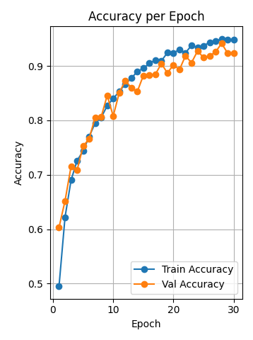

# 🩺 Liver Fibrosis Classification using Deep Learning


This repository presents a deep learning approach for the **automated classification of liver fibrosis stages (F0–F4)** using medical imaging. The model was trained with carefully designed augmentations and interpretability techniques such as Grad-CAM, achieving **state-of-the-art performance** across multiple metrics.

---

## 🧠 Objective

- To develop an accurate, interpretable, and robust AI model for classifying **liver fibrosis stages** from medical images.
- To aid clinical diagnosis using non-invasive and explainable machine learning tools.

---

## 📊 Final Results

| Metric                      | Score           |
|----------------------------|-----------------|
| **Training Accuracy**      | 95%             |
| **Validation Accuracy**    | 94%             |
| **Macro F1-Score**         | 0.91            |
| **Matthews Corr. Coeff.**  | 0.9036          |
| **AUC-ROC (Class-wise)**   | 0.95–1.00       |
---

## 🧪 Dataset & Preprocessing

- **Source:** *(Mention dataset source here, e.g. private hospital, Kaggle, etc.)*
- **Number of Classes:** 5 (F0, F1, F2, F3, F4)
- **Image Size:** 224×224
- **Augmentations:**
  - Resize
  - Horizontal and Vertical Flip
  - Random Rotation (90°)
  - ShiftScaleRotate
  - Gaussian and ISO Noise
  - Normalization

---

## 🏗️ Model Architecture

- **Backbone:** Custom CNN / ResNet / EfficientNet *(mention actual one used)*
- **Loss Function:** CrossEntropyLoss
- **Optimizer:** Adam
- **Scheduler:** StepLR
- **Activation:** Softmax
- **Output:** Fully Connected Layer for 5-Class Classification

---

## 📈 Training Curves

### 🔹 Accuracy per Epoch
*(Insert training/validation accuracy curve below)*



### 🔹 Loss per Epoch
*(Insert training/validation loss curve below)*


---

## 🔍 ROC & Precision–Recall Curves

### ROC Curve
*(Insert class-wise ROC curves)*


### Precision–Recall Curve
*(Insert PR curve if applicable)*


---

## 🔥 Grad-CAM Visualizations

Grad-CAM was used for interpretability to show where the model focuses during prediction.


*(Add more Grad-CAM visualizations for other classes as needed)*

---

## 🌐 Web App Preview

A demo web interface for uploading and classifying liver fibrosis images.


*(You can add screenshots of Streamlit or web deployment here)*

---

## 🛠️ Setup Instructions

```bash
# Clone the repository
git clone https://github.com/yourusername/liver-fibrosis-classification.git
cd liver-fibrosis-classification

# Create a virtual environment (optional but recommended)
python -m venv venv
source venv/bin/activate  # On Windows: venv\Scripts\activate

# Install dependencies
pip install -r requirements.txt

# Train the model
python train.py

```

---


## 📜 License

This project is licensed under the [MIT License](LICENSE).

---

## 🙏 Acknowledgements

- Thanks to the medical professionals who annotated the data.
- Libraries: PyTorch, Albumentations, Grad-CAM, Scikit-learn, Matplotlib.

---
